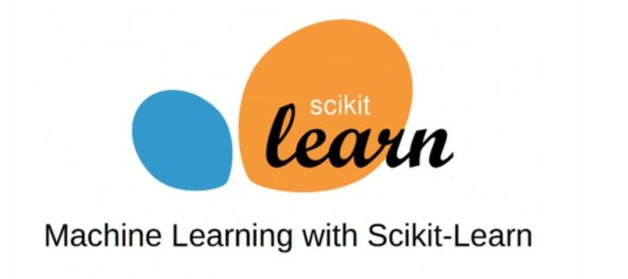
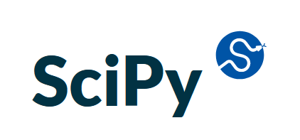

# Title - GMIT Machine Learning and Statistics Repository 2021 - Student Brendan Ryan G00387831

## __Description - About this Repository__

This is my Repository for the Machine Learning and Statistics Module 2021 and the assignment for that module.

The repository gives an overview and working demos of two of the most popular statistical libraries available in python:

 ### __Scikit-Learn__ 
 
 and 

### __SciPy.stats__

 As I am new to Machine Learning / Statistics and don't have a great love for maths! this module and assignment was very challenging. However i enjoyed it none the less and I hope to implement some of the features i learnt in my workplace.

_________

## __The Repository Contents__

Before we look at the files if you are not familiar with Jupyter Notebooks more information can be found by clicking here https://jupyter.org/:

If you are not familiar with the Python programming language more information can be by clicking here https://www.python.org/: 

- __readme.md__ - gives a Description of Repository
- __requirements.txt__ -  Information on Libraries, software required and any dependencies
- __licence__ - GNU GENERAL PUBLIC LICENSE

__________

 ### __skit-learn.ipynb__

A Jupyter notebook written in Python code and includes an overview of Skit-learn and demonstrations of the following sckit-learn algorithms

_Categorisation_
- Decision Tree (Decision Tree Classifier)
- Random Forest (Random Forest Classifier)
- Gradient Bossing (Gradient Boosting Classifier)

_Regression_ 
- Multiple Linear Regression
- Decision Tree Regression (Decision Tree Regresor)

_________________

### __scipy-stats-ipynb__ 

A Jupyter Notebook written in Python code and contains an overview of scipy stats module and demos of common statistical tests

__t-Tests__  

and 

__ANOVA__.

I use two sample datasets for my testing - one is a sample student grades dataset which i downloaded from {} and the other is a sample dataset i extracted from a BI at work which gives details on borrowing habits by demographic(note this dataset does not contain any personal or identifiable information)

Throughout the notebook various plots/images are also included to help the reader visualise the results better.

### __Other folders contained within the repository__

- /images/ contains any images used in the notebooks and files
- /datasets/ contains sample datasets used in my notebooks
- /brendan-code/ contains my own test code and lab work

_________________________

## __How to Run and View my notebooks__

__Details of Git Repository__

The repository for the assignment and all the files are located here https://github.com/brendantipp/gmit_mls_2021

The Jupyter notebooks can also be viewed on my My repository which is held on GitHub  https://github.com/brendantipp/gmit_mls_2021

You can also download and run the Jupyter notebook from the repository to your local hard drive and open with Jupyter Notebooks - www.jupyter.org

The following is useful step by step guide on how to open and run a jupyter notebook - https://jupyter-notebook-beginner-guide.readthedocs.io/en/latest/execute.html
_________________

### View __sckit learn__ notebook in nbviewer or Binder

Click here to view in static form  in binder :  

or 

click here to open notebook in dynamic form: 

### View __scipy.stats__ notebook in nbviewer or Binder

Click here to view in static form  in binder : 

or

click here to open notebook in dynamic form:

________________

#### __Software used__

The software used in the development of this module were

- Annacoda distribution package (Python, Git) - www.anaconda.com
- Jupyter Notebook - www.jupyter.org
- cmder - www.cmder.net
- Github www.github.com
- Visual Studio Code 

_________________

## __References__

Thanks to GMIT and Course Lecturer Ian McLoughlin and fellow students.

____________________

## __Contact Details__

I can be contacted by email Brendan Ryan G00387831@gmit.ie

____________________________
## THE END

